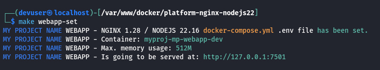
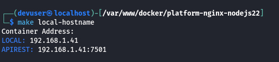
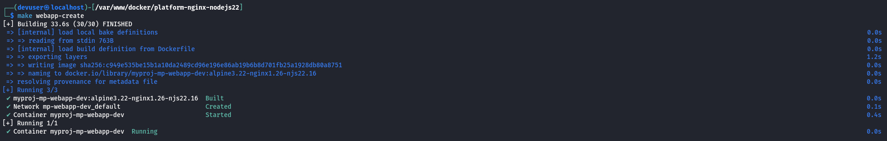
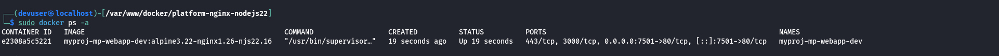
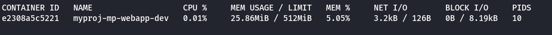
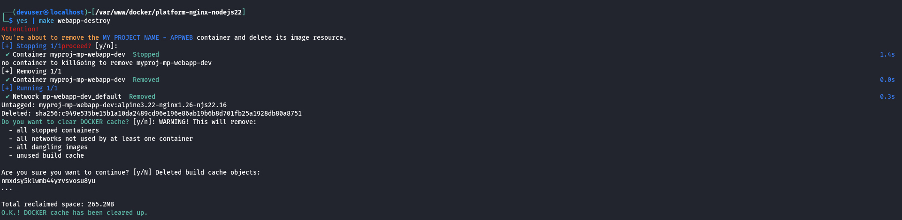
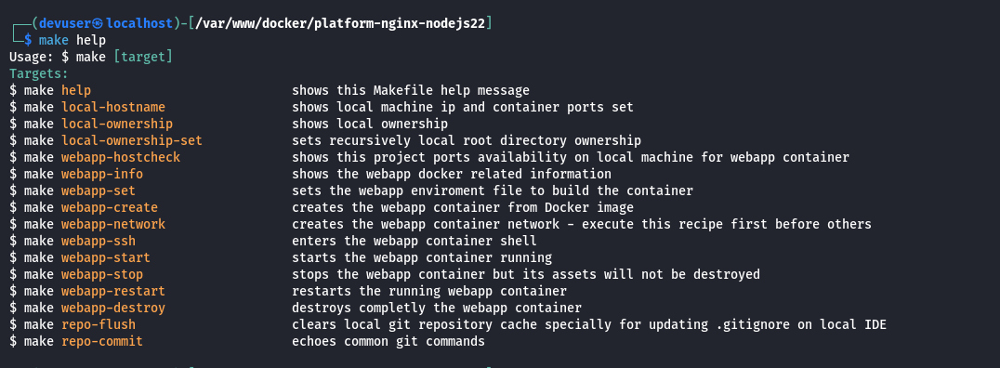

<div id="top-header" style="with:100%;height:auto;text-align:right;">
    
</div>

# INFRASTRUCTURE PLATFORM

# NGINX 1.28, NodeJS 22.16

This Infrastructure Platform repository provides a dedicated stack with Node.js for front-end projects, enabling developers to work within a consistent local development framework that closely mirrors real-world deployment scenarios. Whether your application will run on AWS EC2, Google Cloud GCE instances, or be distributed across Kubernetes pods, this structure ensures smooth transitions between environments.

A key feature of this repository is its modular design: it is intentionally decoupled from its sub-directory ./webapp, allowing the platform to be maintained independently without impacting the associated subproject. This separation supports dedicated upkeep and flexibility for both the platform and its attached web applications.

Additionally, the platform can be run locally with multiple instances to support different development stages of various ./webapp projects simultaneously. It is easily configurable to suit different infrastructure or machine requirements—developers can adjust settings such as container RAM usage, ports, and other platform parameters to best fit their environment.
<br>

## Content of this page:

- [Requirements](#requirements)
- [Platform Features](#platform-features)
- [Container Environment Settings](#setup-containers)
- [Create Docker Container](#create-containers)
- [GNU Make file recipes](#make-help)
- [Use platform with existing repository](#external-repository)
<br><br>

## <a id="requirements"></a>Requirements

Despite Docker’s cross-platform compatibility, for intermediate to advanced software development on environments other than Windows NT or macOS, automating the platform build and streamlining the process of starting feature development is crucial. This automation enables a more dynamic and efficient software development lifecycle.

- Docker
- Docker Compose
- GNU Make *(otherwise commands must be executed manually)*

| Dev machine   | Machine's features                                                                            |
| ------------- | --------------------------------------------------------------------------------------------- |
| CPU           | Linux *(x64 - x86)* /  MacOS Intel *(x64 - x86)*, or M1                                       |
| RAM           | *(for this container)*: 1 GB minimum.                                                         |
| DISK          | 2 GB *(though is much less, it usage could be incremented depending on the project usage)*.   |
<br>

## <a id="platform-features"></a>Platform Features

It can be installed the most known JS **front-end** frameworks:

- [Angular](https://angular.dev/)
- [React](https://react.dev/)
- [Vue3](https://vuejs.org/)
- [Svelte](https://svelte.dev/)
<br>

Take into account that each framework will demand its specific configuration from inside container.
<br><br>

## <a id="setup-containers"></a>Container Environment Settings

Inside `./platform/nginx-nodejs` there are a dedicated GNU Make file and the main Docker directory with the required scripts and stack assets in the `./platform/nginx-nodejs/docker/config` directory to build the required platform configuration. Also, there is a `config.sample` with alternate configuration files suggestions.

Platform Stack:
- Linux Alpine version 3.22
- NGINX version 1.28 *(or the latest on Alpine Package Keeper)*
- NodeJS 22.16 with NPM and YARN installed
<br>

<font color="orange"><b>IMPORTANT:</b></font> Once the container is built, the Nginx server block serves at port 80 to `/var/www/public`. For Frameworks project, this `./platform/nginx-nodejs/docker/config/nginx/conf.d/default.conf` must be set properly to serve static or SSR container port.

There is a `.env.example` file with the variables required to build the container by `docker-compose.yml` file to create the container if no GNU Make is available on developer's machine. Otherwise, it is not required to create its `.env` manually file for building the container. API environment: `./platform/nginx-nodejs/docker/.env`
```bash
COMPOSE_PROJECT_LEAD="myproj"
COMPOSE_PROJECT_CNET="mp-dev"
COMPOSE_PROJECT_IMGK="alpine3.22-nginx1.26-njs22.16"
COMPOSE_PROJECT_NAME="mp-webapp-dev"
COMPOSE_PROJECT_HOST="127.0.0.1"
COMPOSE_PROJECT_PORT=7501
COMPOSE_PROJECT_PATH="../../../webapp"
COMPOSE_PROJECT_MEM="512M"
COMPOSE_PROJECT_SWAP="1G"
COMPOSE_PROJECT_USER="myproj"
COMPOSE_PROJECT_GROUP="myproj"
```

But with GNU Make:
<div style="with:100%;height:auto;text-align:center;">
    
</div>
<br>

Create the root `./.env` file from the [./.env.example](./.env.example) and follow its description to configure the platforms. The end result would be like this:
```bash
SUDO=sudo
DOCKER=sudo docker
DOCKER_COMPOSE=sudo docker compose

PROJECT_NAME="MY PROJECT NAME"
PROJECT_LEAD=myproj
PROJECT_HOST="127.0.0.1"
PROJECT_CNET=mp-dev

WEBAPP_PLTF=nginx-nodejs
WEBAPP_IMGK=alpine3.22-nginx1.26-njs22.16
WEBAPP_PORT=7501
WEBAPP_BIND="../../../webapp"
WEBAPP_CAAS=mp-webapp-dev
WEBAPP_CAAS_USER=myproj
WEBAPP_CAAS_GROUP=myproj
WEBAPP_CAAS_MEM=512M
WEBAPP_CAAS_SWAP=1G
WEBAPP_GIT_SSH=~/.ssh/id_rsa
WEBAPP_GIT_HOST=github.org
WEBAPP_GIT_BRANCH=develop
WEBAPP_DOMAIN=
```

Once the environment file is set, create each Docker environment file by the automated commands using GNU Make:

Set up the API container
```bash
$ make webapp-set
```
<div style="with:100%;height:auto;text-align:center;">
    
</div>

Watch the local hostname IP on which Docker serves and the ports assigned, even though the API can be accessed through `http://127.0.0.1` or `http://localhost`
```bash
$ make local-hostname
```
<div style="with:100%;height:auto;text-align:center;">
    
</div>
<br>

## <a id="create-containers"></a>Create and Start Docker Container

Create and start up the API container
```bash
$ make webapp-create
```
<div style="with:100%;height:auto;text-align:center;">
    
</div>
<br>

Docker information of both cointer up and running
<div style="with:100%;height:auto;text-align:center;">
    
</div>
<div style="with:100%;height:auto;text-align:center;">
    
</div>
<br>

Despite the container can be stop or restarted, it can be stop and destroy to clean up locally from Docker generated cache, without affecting other containers running on the same machine.
```bash
$ yes | make webapp-destroy
```
<div style="with:100%;height:auto;text-align:center;">
    
</div>
<br>

## <a id="make-help"></a>GNU Make file recipes

The project's main `./Makefile` contains recipes with the commands required to manage each platform's Makefile from the project root.

This streamlines the workflow for managing the container with mnemonic recipe names, avoiding the effort of remembering and typing each bash command line.

<div style="with:100%;height:auto;text-align:center;">
    
</div>
<br>

## <a id="external-repository"></a>Use platform with existing repository

Remove the ./webapp directory with the default installation content from from local and git cache.

Install a working repository into webapp directory. There are two alternatives to manage both platform and webapp repository independetely

### Web application as git sub-module

With this method, developers can only commit changes from inside the container, and push them into remote version control service. The container must have the keys to access and modify remote repository.
```bash
$ git rm -r ./webapp
$ git clean -fd
$ git reset --hard
$ rm -rfv ./webapp/*
$ rm -rfv ./webapp/.*
$ git add sub-module git@[vcs]:[account]/[repository].git ./webapp
```

### Web application as detached repository *(recommended)*

The advantage of this method is that developers can commit changes from inside and outside the container, and push them into remote version control service.
```bash
$ git rm -r ./webapp
$ git clean -fd
$ git reset --hard
$ rm -rfv ./webapp/*
$ rm -rfv ./webapp/.*
$ cd ./webapp
$ git clone git@[vcs]:[account]/[repository].git .
```

<!-- FOOTER -->
<br>

---

<br>

- [GO TOP ⮙](#top-header)

<div style="with:100%;height:auto;text-align:right;">
    
</div>