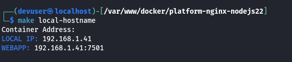
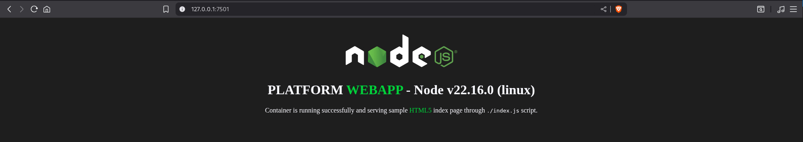

<div id="top-header" style="with:100%;height:auto;text-align:right;">
    
</div>

# INFRASTRUCTURE PLATFORM

# NGINX 1.28, NODEJS 22.16

This Infrastructure Platform repository provides a dedicated stack with Node.js for front-end projects, enabling developers to work within a consistent local development framework that closely mirrors real-world deployment scenarios. Whether your application will run on AWS EC2, Google Cloud GCE instances, or be distributed across Kubernetes pods, this structure ensures smooth transitions between environments.

A key feature of this repository is its modular design: it is intentionally decoupled from its sub-directory ./webapp, allowing the platform to be maintained independently without impacting the associated subproject. This separation supports dedicated upkeep and flexibility for both the platform and its attached web applications.

Additionally, the platform can be run locally with multiple instances to support different development stages of various ./webapp projects simultaneously. It is easily configurable to suit different infrastructure or machine requirements—developers can adjust settings such as container RAM usage, ports, and other platform parameters to best fit their environment.
<br>

## Content of this page:

- [Requirements](#requirements)
- [Platform Features](#platform-features)
- [Container Environment Settings](#setup-containers)
- [Build and run the Web Application Container](#create-containers)
- [GNU Make file recipes](#make-help)
- [Use this Platform Repository with an existing web application repository](#external-repository)
<br><br>

## <a id="requirements"></a>Requirements

Despite Docker’s cross-platform compatibility, for intermediate to advanced software development on environments other than Windows NT or macOS, automating the platform build and streamlining the process of starting feature development is crucial. This automation enables a more dynamic and efficient software development lifecycle.

- **Docker**: Containerizes applications for consistent environments.
- **Docker Compose**: Manages multi-container setups and dependencies.
- **GNU Make**: Automates build commands and workflows *(otherwise, commands must be executed manually)*.

If you don't use GNU Make, execute commands inside `./platform/nginx-nodejs/docker/` directory by setting an `./platform/nginx-nodejs/docker/.env` file from `./platform/nginx-nodejs/docker/.env.example`.

| Dev machine   | Machine's features                                                                            |
| ------------- | --------------------------------------------------------------------------------------------- |
| CPU           | Linux *(x64 - x86)* /  MacOS Intel *(x64 - x86)*, or M1                                       |
| RAM           | *(for this container)*: 1 GB minimum.                                                         |
| DISK          | 2 GB *(though is much less, it usage could be incremented depending on the project usage)*.   |
<br>

## <a id="platform-features"></a>Platform Features

It can be installed the most known JS **front-end** frameworks:

- [Angular](https://angular.dev/)
- [React](https://react.dev/)
- [Vue3](https://vuejs.org/)
- [Svelte](https://svelte.dev/)
- Others...
<br>

Take into account that each framework will demand its specific configuration from inside container.
<br>

**Stack:**
- Linux Alpine version 3.22
- NGINX version 1.28 *(or the latest on Alpine Package Keeper)*
- NodeJS 22.16 with NPM and YARN installed
<br><br>

## <a id="setup-containers"></a>Container Environment Settings

Inside `./platform/nginx-nodejs` there are a dedicated GNU Make file and the main Docker directory with the required scripts and stack assets in the `./platform/nginx-nodejs/docker/config` directory to build the required platform configuration. Otherwise, it is not required to create its `.env` manually file for building the container.

> **Note**: There is a `.env.example` file with the variables required to build the container by `docker-compose.yml` file to create the container if no GNU Make is available on developer's machine. Otherwise, it is not required to create its `.env` manually file for building the container. web app environment: `./platform/nginx-nodejs/docker/.env`

```bash
COMPOSE_PROJECT_LEAD="myproj"
COMPOSE_PROJECT_CNET="mp-dev"
COMPOSE_PROJECT_IMGK="alpine3.22-nginx1.26-njs22.16"
COMPOSE_PROJECT_NAME="mp-webapp-dev"
COMPOSE_PROJECT_HOST="127.0.0.1"
COMPOSE_PROJECT_PORT=7501
COMPOSE_PROJECT_PATH="../../../webapp"
COMPOSE_PROJECT_MEM="512M"
COMPOSE_PROJECT_SWAP="1G"
COMPOSE_PROJECT_USER="myproj"
COMPOSE_PROJECT_GROUP="myproj"
```

<span style="color: green;"><b>Using GNU Make</b></span> from root directory to configure the container environment, create the root `./.env` file from the [./.env.example](./.env.example) and follow its variables description to set the correct values. The end result would be like this:
```bash
SUDO=sudo
DOCKER=sudo docker
DOCKER_COMPOSE=sudo docker compose

PROJECT_NAME="MY PROJECT NAME"
PROJECT_LEAD=myproj
PROJECT_HOST="127.0.0.1"
PROJECT_CNET=mp-dev

WEBAPP_PLTF=nginx-nodejs
WEBAPP_IMGK=alpine3.22-nginx1.26-njs22.16
WEBAPP_PORT=7501
WEBAPP_BIND="../../../webapp"
WEBAPP_CAAS=mp-webapp-dev
WEBAPP_CAAS_USER=myproj
WEBAPP_CAAS_GROUP=myproj
WEBAPP_CAAS_MEM=512M
WEBAPP_CAAS_SWAP=1G
WEBAPP_GIT_SSH=~/.ssh/id_rsa
WEBAPP_GIT_HOST=github.org
WEBAPP_GIT_BRANCH=develop
WEBAPP_DOMAIN=
```

Once the environment file is set, create each Docker environment file by the automated commands using GNU Make:

Set up the web application container
```bash
$ make webapp-set
```
<div style="with:100%;height:auto;text-align:center;">
    
</div>

Watch the local hostname IP on which Docker serves and the ports assigned, even though the web app can be accessed through `http://127.0.0.1` or `http://localhost`
```bash
$ make local-hostname
```
<div style="with:100%;height:auto;text-align:center;">
    
</div>
<br>

## <a id="create-containers"></a>Build and run the Web Application Container

Create and start up the web app container
```bash
$ make webapp-create
```
<div style="with:100%;height:auto;text-align:center;">
    
</div>
<br>

<span color="orange"><b>IMPORTANT:</b></span> Once the container is built and running, the Nginx server block serves at port 80 proxing to port 3000 to be handled by NodeJS. On first installation will fail as it is needing to install the required packages with NPM from inside the container.

<div style="with:100%;height:auto;text-align:center;">
    
</div>
<br>

To preview the successful installation on browser, there is a basic home page sample at `./resources/docs/webapp/default-install/`. Copy its content into `./webapp` directory
```bash
$ cp -a ./resources/docs/webapp/default-install/. ./webapp
```

Then, access into the container to install require NodeJS packages and restart the container
```bash
$ make webapp-ssh

/var/www $ npm install
/var/www $ exit

$ make webapp-restart
```
<div style="with:100%;height:auto;text-align:center;">
    
</div>
<br>

Now you can see on browser the NodeJS application running
<div style="with:100%;height:auto;text-align:center;">
    
</div>
<br>

Docker information of both cointer up and running
<div style="with:100%;height:auto;text-align:center;">
    
</div>
<div style="with:100%;height:auto;text-align:center;">
    
</div>
<br>

Also there is a **useful GNU Make recipe** to see the container relevant information. This is important when is developing on dev mode inside the container, when for this example, you would see the framework development stage on Docker port, e.g. `http://172.18.0.2:8080` - *NOT ON YOUR MACHINE LOCALHOST*

<div style="with:100%;height:auto;text-align:center;">
    
</div>
<br>

Despite the container can be stop or restarted, it can be stop and destroy to clean up locally from Docker generated cache, without affecting other containers running on the same machine.
```bash
$ make webapp-destroy
```
<div style="with:100%;height:auto;text-align:center;">
    
</div>
<br>

## <a id="make-help"></a>GNU Make file recipes

The project's main `./Makefile` contains recipes with the commands required to manage each platform's Makefile from the project root.

This streamlines the workflow for managing the container with mnemonic recipe names, avoiding the effort of remembering and typing each bash command line.

<div style="with:100%;height:auto;text-align:center;">
    
</div>
<br>

## <a id="external-repository"></a>Use this Platform Repository with an existing web application repository

Here’s a step-by-step guide for both alternatives, assuming you want to:

- Remove the existing `./webapp` directory and its contents from local and git cache
- Install your desired repository inside `./webapp`
- Choose between Git submodule and detached repository approaches
<br>

## Managing the `webapp` Directory: Submodule vs Detached Repository

To remove the `./webapp` directory with the default installation content and install your desired repository inside it, there are two alternatives for managing both the platform and webapp repositories independently:

### 1. **GIT Sub-module**

> Git commands can be executed **only from inside the container**.

- Remove `webapp` from local and git cache:
  ```bash
  $ rm -rfv ./webapp/* ./webapp/.[!.]*$
  $ git rm -r --cached webapp
  $ git commit -m "Remove webapp directory and its default installation"
  ```

- Add the desired repository as a submodule:
  ```bash
  $ git submodule add git@[vcs]:[account]/[repository].git ./webapp
  $ git commit -m "Add webapp as a git submodule"
  ```

- To update submodule contents:
  ```bash
  $ cd ./webapp
  $ git pull origin main  # or desired branch
  ```

- To initialize/update submodules after `git clone`:
  ```bash
  $ git submodule update --init --recursive
  ```

---

### 2. **GIT Detached Repository (Recommended)**

> Git commands can be executed **whether from inside the container or on the local machine**.

- Remove `webapp` from local and git cache:
  ```bash
  $ rm -rfv ./webapp/* ./webapp/.[!.]*
  $ git rm -r --cached webapp
  $ git clean -fd
  $ git reset --hard
  $ git commit -m "Remove webapp directory and its default installation"
  ```

- Clone the desired repository as a detached repository:
  ```bash
  $ git clone git@[vcs]:[account]/[repository].git ./webapp
  ```

- The `webapp` directory is now an **independent repository**, not tracked as a submodule in your main repo. You can use `git` commands freely inside `webapp` from anywhere.

---

#### **Summary Table**

| Approach         | Repo independence | Where to run git commands | Use case                        |
|------------------|------------------|--------------------------|----------------------------------|
| Submodule        | Tracked by main  | Inside container         | Main repo controls webapp version|
| Detached (rec.)  | Fully independent| Local or container       | Maximum flexibility              |

---

> After switching to either alternative, consider adding `webapp/` to your `.gitignore` in the main repo to prevent accidental tracking (especially for detached repo).

<!-- FOOTER -->
<br>

---

<br>

- [GO TOP ⮙](#top-header)

<div style="with:100%;height:auto;text-align:right;">
    
</div>